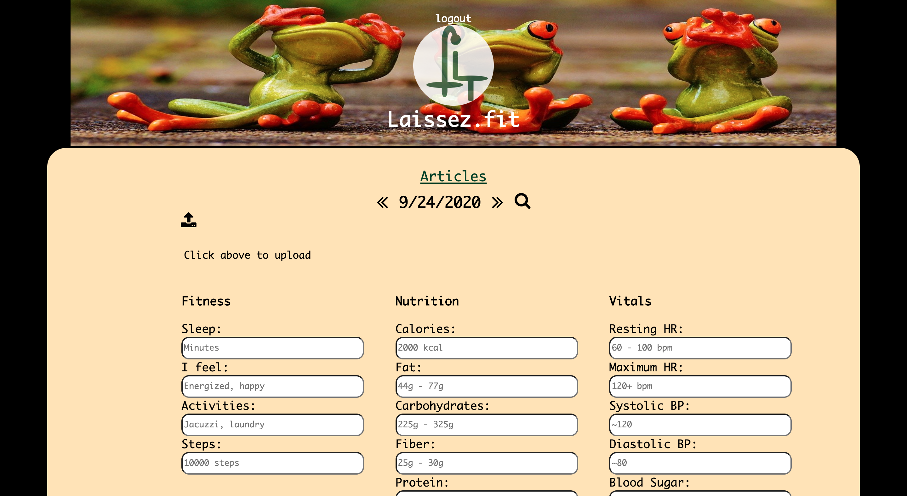
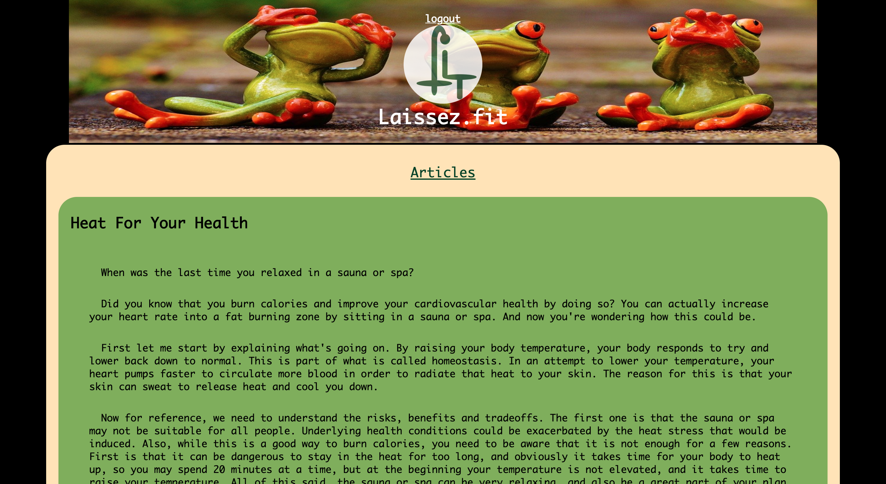

## Laissez.fit API

RESTful API for Laissez.fit Client. 

# Live App

https://laissez-fit-client.vercel.app/

# Introduction

This app addresses the problems that arise from our modern "lazy" lifestyles. 
If we could manage to be a little more active, and a little less stressed, and
eat a little better, a little less medicated and more knowledgeable in our
approach to our health, we can lead happier, more productive lives. We can do
things we don't think possible. We can age better and live smarter and do
more by doing less. If this sounds like something for you then Laissez.fit is 
the fitness tracking and awareness app for you. 

# Methods

There are four main endpoints including login and signup, which are POST requests, tracking which includes a GET, UPDATE, and POST endpings, articles includes a GET request, and lastly, the comments include a GET, POST and DELETE. 

# URL Params

Articles GET for a specific article must include an article_id param which is an integer

Comments DELETE endpoint must include the comment_id as a param and is an integer.

Comments GET and POST must include an article_id param, which is an integer.

Tracking endpoints must all include an user_id as an integer followed by tracking_date as a date formatted as YYYY-MM-D.

The DELETE method on the users endpoint must include a user_id param as an integer.

# Data Params

The Tracking endpoint includes the following optional body params: 

      rhr - resting heart rate
      mhr - max heart rate
      bps - systolic blood pressure
      bpd - diastolic blood pressure
      bls - blood sugar
      ins - height in inches
      lbs - weight in pounds
      cal - calories consumed
      fat - fat consumed
      car - carbohydrates consumed
      fib - fiber consumed
      pro - protein consumed
      stp - steps for the day
      slp - sleep in minutes
      act - activities
      men - mental/emotional/physical state
      dia - diary of day

# Usage

Tracking is a achieved by typing your data into the input fields. While a 
wearable is great here, there are metrics you can take that a wearable cannot
provide. You can input blood glucose, and blood pressure, you can input macro-
nutrients and total calories, and track your mood. There is even a place for 
you to write about whatever you like. You can only upload one value for each
input per day. However you can update those values as often as you like. So if
you want to put your calories tracked in the morning and upload changes through
the day, you can, just remember that you do have to put the whole number of 
calories consumed at the given time. If you had 400 calories in the morning, 
then 800 at lunch, you would add the two and input 1200. Also, users can add 
comments and delete their own comments. 

Endpoints include articles, comments, tracking and users. Each contains a service with knex to process requests. The users endpoint is configured to create a user or login a user. The articles endpoint simply gets the articles, then the client orders them by topic. The comments endpoint includes functionality to add or delete comments, and the article id is pulled to send to the database through the service and attach it to the article.

Tracking includes many fields, but none of them are required. Some fields are numerical, but will remove non-integer characters. For example if 1500 calories was entered, then it would take 1500 and insert that into the database.

# Stack

Express with Postgres DB

# Screenshots

